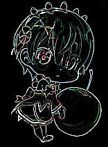

# Basic Tools
Belong to ``namespace lolita`` , some basic functions.

# Demo
```C++
#include <lolita/lolita.h>
#include <iostream>
#include <cstdio>

using namespace lolita;

int main()
{
	Image mat;
	Bmp::read(mat,"24.bmp");
	Image backup = mat;
	averageBlur(mat, 3);
	Bmp::write(mat,"blur.bmp");
	detectEdge(backup);
	Bmp::write(backup,"edge.bmp");
}
```




# API list
---
```C++
/******************************************************************************************
 * Name       : grayScale
 * 
 * Input      : mat - source image
 * 
 * Output     : mat - gray-scale image
 * 
 * Return     : void
 * 
 * Function   : Convert a image to gray-scale image
 ******************************************************************************************/
void grayScale(Image& mat);
```

---
```C++
/******************************************************************************************
 * Name       : binaryzation
 * 
 * Input      : mat - source gray-scale image
 * 
 *              threshold - pixel in range of [threshold, 255] will be set as 255
 *                          pixel in range of [0, threshold)  will be set as 0
 *                          if threshold is 0 , this function will calculate a threshold by 
 *                          Kittler Algorithm
 * 
 * Output     : mat - binaryzation image
 * 
 * Return     : void
 * 
 * Function   : Convert a gray-scale image to binaryzation image
 ******************************************************************************************/
void binaryzation(Image& mat, uint8_t threshold);
```

---
```C++
/******************************************************************************************
 * Name       : convolution
 * 
 * Input      : mat - source image
 * 
 *              kernel - a real matrix 
 * 
 * Output     : mat - convoluted image
 * 
 * Return     : bool
 * 
 * Function   : mat convolute kernel
 ******************************************************************************************/
bool convolution(Image& mat, Mat<double>& kernel)
```

---
```C++
/******************************************************************************************
 * Name       : detectEdge
 * 
 * Input      : mat - source image
 * 
 * Output     : mat - treated image
 * 
 * Return     : void
 * 
 * Function   : edge detector
 ******************************************************************************************/
void detectEdge(Image& mat);
```

---
```C++
/******************************************************************************************
 * Name       : averageBlur
 * 
 * Input      : mat - source image
 * 
 *              radius - radius of convolution kernel
 * 
 * Output     : mat - treated image
 * 
 * Return     : void
 * 
 * Function   : blur image by average
 ******************************************************************************************/
void averageBlur(Image& mat, uint32_t radius)
```

---
```C++
/******************************************************************************************
 * Name       : medianBlur
 * 
 * Input      : mat - source image
 * 
 *              radius - radius of convolution kernel
 * 
 * Output     : mat - treated image
 * 
 * Return     : void
 * 
 * Function   : blur image by median value
 ******************************************************************************************/
void medianBlur(Image& mat, uint32_t radius);
```

---
```C++
/******************************************************************************************
 * Name       : gaussianBlur
 * 
 * Input      : mat - source image
 * 
 *              radius - radius of convolution kernel
 * 
 *              variance - sigma of Gaussian distribution
 * 
 * Output     : mat - treated image
 * 
 * Return     : void
 * 
 * Function   : blur image by Gaussian distribution
 ******************************************************************************************/
void gaussianBlur(Image& mat, uint32_t radius, double variance);
```

---
```C++
/******************************************************************************************
 * Name       : dilate
 * 
 * Input      : mat - source image
 * 
 *              radius - radius of convolution kernel
 * 
 * Output     : mat - treated image
 * 
 * Return     : void
 * 
 * Function   : dilate image by maximum value of area
 ******************************************************************************************/
void dilate(Image& mat, uint32_t radius);
```

---
```C++
/******************************************************************************************
 * Name       : erode
 * 
 * Input      : mat - source image
 * 
 *              radius - radius of convolution kernel
 * 
 * Output     : mat - treated image
 * 
 * Return     : void
 * 
 * Function   : erode image by minimum value of area
 ******************************************************************************************/
void erode(Image& mat, uint32_t radius);
```


---
```C++
/******************************************************************************************
 * Name       : resize
 * 
 * Input      : mat - source image
 * 
 *              width - width of new image
 * 
 *              height - height of new image
 * 
 * Output     : mat - treated image
 * 
 * Return     : void
 * 
 * Function   : resize a image by bicubic interpolation
 ******************************************************************************************/
void bicubic(Image& mat, uint32_t width, uint32_t height);
```